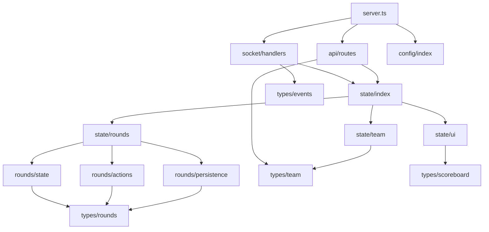

# Improvscoreboard Server Developer Notes

## Fucking Module Architecture

### Core Modules Overview
1. **State Management** (`/src/modules/state/`)
   - `index.ts`: Core state management and exports
   - `team.ts`: Team-specific state operations
   - `ui.ts`: UI-related state operations
   - `rounds/`: Fucking round system operations
     - `state.ts`: Round state management and defaults
     - `actions.ts`: Round manipulation functions
     - `persistence.ts`: Round state persistence

2. **Socket Handlers** (`/src/modules/socket/`)
   - `handlers.ts`: WebSocket event handling
   - Manages real-time communication with clients

3. **API Routes** (`/src/modules/api/`)
   - `routes.ts`: REST API endpoints
   - Currently handles basic state retrieval and score updates
   - Extensible for future HTTP endpoints

4. **Configuration** (`/src/modules/config/`)
   - `index.ts`: Server configuration including CORS, static serving, etc.
   - Environment-specific settings

### Type System Organization
Located in `/src/types/`:
- `team.types.ts`: Team interfaces and related payloads
- `scoreboard.types.ts`: Main state and UI-related types
- `rounds.types.ts`: Round system interfaces and payloads
- `ui.types.ts`: UI element interfaces and payloads
- `events.types.ts`: WebSocket event interfaces
- `index.ts`: Type re-exports (barrel file)

## Module Dependencies

## State Management Flow
1. **Global State**
   - Single source of truth in `state/index.ts`
   - Deep copy on read via `getState()`
   - Validated updates via `updateState()`

2. **Team State**
   - Initial team setup
   - Score and penalty management
   - Team customization (names, colors)

3. **UI State**
   - Logo and text management
   - Visibility controls
   - Style configurations
   - Emoji state handling

4. **Round State**
   - Round configuration management
   - Round history tracking
   - Round settings control
   - Default round templates
   - State validation and error handling
   - Fucking persistence across sessions

## WebSocket Event Flow
1. Client connects → Receives initial state
2. Client sends event → Handler processes
3. State updates → Broadcast to all clients
4. Error handling → Logs and client feedback

## Future Enhancements
1. **State Persistence**
   - Implement JSON file storage ✓
   - Add database support
   - Consider Redis for caching

2. **Logging System**
   - Add structured logging
   - Error tracking
   - Performance monitoring

3. **Testing**
   - Unit tests for state management
   - Socket event testing ✓
   - API endpoint testing

4. **Configuration Management**
   - Environment-based config
   - Secret management
   - Feature flags

## Best Practices
1. Keep files under 500 lines
2. Use TypeScript strictly
3. Log all state changes
4. Handle errors gracefully
5. Document new features
6. Split large modules into focused files
7. Follow fucking error handling patterns
8. Maintain consistent state validation

